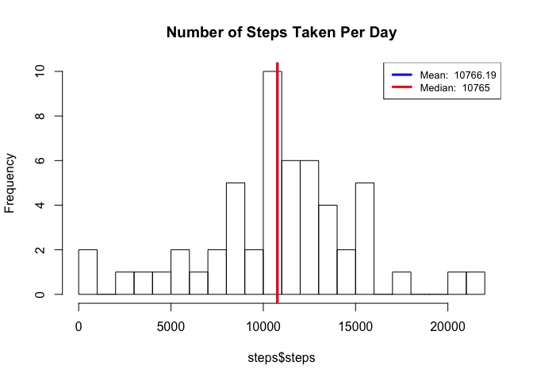
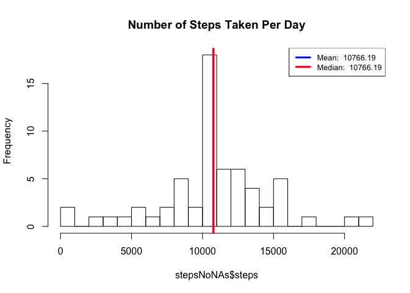

# Reproducible Research: Peer Assessment 1


### Loading and preprocessing the data
First, all environment variables will br removed.

```r
rm(list=ls(all=TRUE)) 
```

Next, required data for this assignment will be downloaded and extracted.

Data description from coursera:

> This assignment makes use of data from a personal activity monitoring device. This device collects data at 5 minute intervals through out the day. The data consists of two months of data from an anonymous individual collected during the months of October and November, 2012 and include the number of steps taken in 5 minute intervals each day.
>
> The data for this assignment can be downloaded from the course web site:
>
>  * Dataset: [Activity monitoring data](https://d396qusza40orc.cloudfront.net/repdata%2Fdata%2Factivity.zip) [52K]
> 
> The variables included in this dataset are:
> 
>  * *steps*: Number of steps taking in a 5-minute interval (missing values are coded as 𝙽𝙰)
 * *date*: The date on which the measurement was taken in YYYY-MM-DD format
 * *interval*: Identifier for the 5-minute interval in which measurement was taken
> 
> The dataset is stored in a comma-separated-value (CSV) file and there are a total of 17,568 observations in this dataset.


```r
# Init variables about zipfilename and fileURL
zipFileName <- "activity.zip"
fileURL <- "https://d396qusza40orc.cloudfront.net/repdata%2Fdata%2Factivity.zip"

# If zip file isn't stored, it will be downloaded.
if (!file.exists(zipFileName)){
  download.file(fileURL, zipFileName, method="curl")
}  

# Upzip downloaded zip file
if (file.exists(zipFileName)) { 
  unzip(zipFileName) 
}
```

File "activity.csv" will be read in and be displayed its structure.

```r
# Read file
activity=read.csv("activity.csv")

# Display data structure
names(activity)
```

```
## [1] "steps"    "date"     "interval"
```

```r
str(activity)
```

```
## 'data.frame':	17568 obs. of  3 variables:
##  $ steps   : int  NA NA NA NA NA NA NA NA NA NA ...
##  $ date    : Factor w/ 61 levels "2012-10-01","2012-10-02",..: 1 1 1 1 1 1 1 1 1 1 ...
##  $ interval: int  0 5 10 15 20 25 30 35 40 45 ...
```

```r
head(activity)
```

```
##   steps       date interval
## 1    NA 2012-10-01        0
## 2    NA 2012-10-01        5
## 3    NA 2012-10-01       10
## 4    NA 2012-10-01       15
## 5    NA 2012-10-01       20
## 6    NA 2012-10-01       25
```


---

### What is mean total number of steps taken per day?
---
First, data will be processed into a suitable format for analysis.

```r
# Aggregate data
steps<-aggregate(steps~date,data=activity,sum,na.rm=TRUE)
```

Now, the **mean** and **median** total number of steps taken per day will be calculated.

```r
meanStep <- mean(steps$steps)
medianStep <- median(steps$steps)
```


Next, to get a good overview, a histogram will be created.

```r
#Create histogram
hist(steps$steps, breaks = 20, main = "Number of Steps Taken Per Day")

#Draw mean and median line
abline(v=meanStep, lwd = 3, col = 'blue')
abline(v=medianStep, lwd = 3, col = 'red')

#Create legend
legend('topright', lty = 1, lwd = 3, col = c("blue", "red"),
         cex = .8, 
         legend = c(paste('Mean: ', format(mean(steps$steps), scientific=FALSE)),
         paste('Median: ', format(median(steps$steps), scientific=FALSE)))
)
```

<!-- -->

 * __Mean__ of steps taken per day: 10766.19 steps
 * __Median__ of steps taken per day: 10765 steps


---

### What is the average daily activity pattern?
First, data will be processed into a suitable format for analysis.

```r
# Aggregate data
stepsInterval<-aggregate(steps ~ interval, data = activity, mean, na.rm=TRUE)
```

Identify that interval with the highest average value in the data.

```r
maxValue <- stepsInterval[which.max(stepsInterval$steps),]
```
It is the **835th** interval.

Now, the following chart will show what the average daily activity pattern is.
X-Axis will represent the 5-minute interval and Y-axis the averaged steps across all days for each interval.

```r
#Create plot
plot(steps ~ interval,
     data = stepsInterval,
     type = "l",
     main = "Average Steps by Time Interval",
     xlab = "5 Minute Time Interval",
     ylab = "Average Number of Steps")


#Collect Cooridinates of The Max Interval For Graphing
points(maxValue$interval,  maxValue$steps, col = 'red', lwd = 3, pch = 19)

#Add Label To Annotate Maximum # Steps And Interval
legend("topright",
       legend   = paste0('Maximum Of ', format(maxValue$step, scientific=FALSE),
                         ' Steps \n is in Interval ', maxValue$interval, "."),
       text.col = 'red',
       bty      = 'n')
```

<!-- -->

 * __Maximum__ of 206.1698 is in interval 835.


---

### Imputing missing values
Here, the number of missing values in the dataset will be calculated.
(Number of rows with NAs)

```r
sum(is.na(activity$steps))
```

```
## [1] 2304
```

Total 2304 rows are missing.

An easy was to fill missed values is to use mean of the respective interval.
The following function returns the mean for a certain interval.

```r
interval2steps<-function(interval){
    stepsInterval[stepsInterval$interval==interval,]$steps
}
```

Now, another dataset will be created. Here, the original data will be copied and all NAs will be replaced by the mean of the respective interval. Additionally, the number of replaced NAs will be counted.

```r
activityNoNAs<-activity   # Make a new dataset with the original data
count=0           # Count the number of data filled in
for(i in 1:nrow(activityNoNAs)){
    if(is.na(activityNoNAs[i,]$steps)){
        activityNoNAs[i,]$steps<-interval2steps(activityNoNAs[i,]$interval)
        count=count+1
    }
}
cat("Total ",count, "NA values were filled.\n\r")  
```

```
## Total  2304 NA values were filled.
## 
```

Next, we use the same approach to analyse data as in chapter "What is mean total number of steps taken per day?" (Creating of histogram incl. mean and median)

```r
# Aggregate data
stepsNoNAs<-aggregate(steps~date,data=activityNoNAs,sum,na.rm=TRUE)

# Calculte mean and median
meanStepNoNAs <- mean(stepsNoNAs$steps)
medianStepNoNAs <- median(stepsNoNAs$steps)

#Create histogram
hist(stepsNoNAs$steps, breaks = 20, main = "Number of Steps Taken Per Day")

#Draw mean and median line
abline(v=meanStepNoNAs, lwd = 3, col = 'blue')
abline(v=medianStepNoNAs, lwd = 3, col = 'red')

#Create legend
legend('topright', lty = 1, lwd = 3, col = c("blue", "red"),
       cex = .8, 
       legend = c(paste('Mean: ', format(mean(stepsNoNAs$steps),
                                         scientific=FALSE)),
                  paste('Median: ', format(median(stepsNoNAs$steps),
                                           scientific=FALSE)))
)
```

<!-- -->

Do these values differ from the estimates from the first part of the assignment? What is the impact of imputing missing data on the estimates of the total daily number of steps?

 * __Mean__ of steps taken per day: 10766.19 steps
 * __Median__ of steps taken per day: 10766.19 steps

The *mean* value is the *same* as before fill the NAs. That's because all NAs were replaced by mean of the respective interval. The median value increased a little bit and is almost the same as the mean value. This increase depends on where the missing values are.


---

### Are there differences in activity patterns between weekdays and weekends?
First a factor with two levels (“weekday” and “weekend”) will be added to the dataset.

```r
activityNoNAs$day=ifelse(as.POSIXlt(as.Date(activityNoNAs$date))$wday%%6==0,
                          "weekend", "weekday")
# For Sunday and Saturday : weekend, Other days : weekday 
activityNoNAs$day=factor(activityNoNAs$day,levels=c("weekday", "weekend"))
```

Finally, a plot will be created with a comparison between the average daily activity pattern of weekday and weekend. The approach is simalar to chapter "What is the average daily activity pattern?".

```r
stepsIntervalNoNAs <- aggregate(steps ~ interval + day, data = activityNoNAs, mean)
library(lattice)
xyplot(steps~interval|factor(day), data=stepsIntervalNoNAs, aspect=1/2, type="l")
```

<!-- -->
